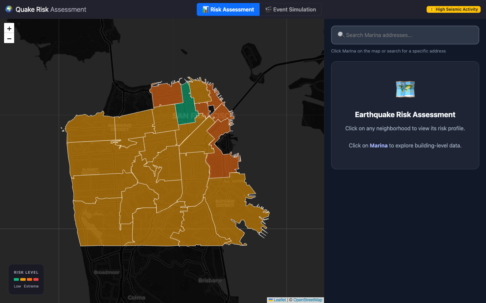
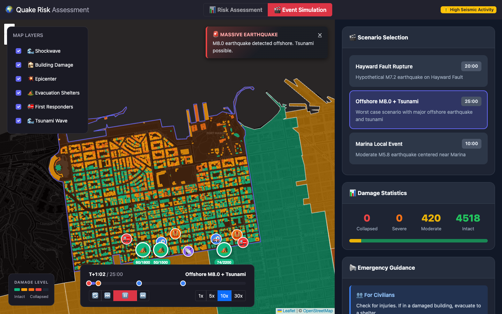

# Earthquake Risk Dashboard

**Live Demo:** [https://shreyaspasumarthi.github.io/earthquake-dashboard](https://shreyaspasumarthi.github.io/earthquake-dashboard)

I built this to explore how real-time simulation and geospatial data visualization can make complex risk data accessible and actionable. The dashboard combines a multi-factor risk scoring engine with a temporal disaster simulation — earthquake shockwave propagation, multi-phase tsunami modeling, and dynamic emergency response — all running client-side in the browser at 60 FPS across ~800 buildings.


### Risk Assessment Mode


### Event Simulation Mode


---

## What It Does

The dashboard operates in two distinct modes:

### Risk Assessment Mode
- **Neighborhood-level choropleth** of San Francisco with 6-dimensional risk scoring (seismic, liquefaction, tsunami, infrastructure, displacement, property)
- **Building-level drill-down** into the Marina District (~800 buildings) with per-structure risk scores derived from age, material, floor count, retrofit status, and soil conditions
- **Contextual neighbor analysis** — each building's risk factors in surrounding structures within 150m (cascading failure potential, debris risk)
- **What-If tool** — modify building attributes (year built, material, retrofit status) and see risk scores recalculate in real time
- **Personalized recommendations** engine that generates actionable preparedness steps based on building characteristics

### Event Simulation Mode
- **3 disaster scenarios**: Hayward Fault M7.2 rupture, Offshore M8.0 + tsunami, Marina local M6.5 event
- **Seismic shockwave propagation** visualized as expanding radial waves from the epicenter
- **Multi-phase tsunami simulation** with approach, inundation (ease-out), peak flooding, and recession (ease-in cubic) — including a curved wavefront with foam/whitecap rendering
- **782 buildings update damage state every frame** using a physics-inspired model (magnitude, distance, material multipliers, liquefaction amplification)
- **Emergency response layer**: 7 first responder units with interpolated waypoint movement, 3 evacuation shelters with real-time capacity fill indicators
- **Alert system** with 4 severity levels (critical/warning/advisory/info), auto-dismiss timers, and a tsunami countdown banner
- **Post-event summary modal** with aggregate damage statistics

---

## Technical Highlights

### Architecture
- **Single-page React app** with 19 coordinated state variables managed via hooks (`useState`, `useEffect`, `useCallback`, `useRef`)
- **Custom Leaflet integration** — bypassed React-Leaflet's `onEachFeature` (broken for `GeometryCollection` types) with native `L.geoJSON` bindings and manual event delegation for reliable click handling on 12 neighborhood polygons
- **`requestAnimationFrame` render loop** for simulation playback with variable speed (1x–20x) and scrubber seeking
- **Batched damage calculations** — all 782 buildings computed per frame in ~4ms, avoiding per-component recalculation

### Data Pipeline
- GeoJSON neighborhood boundaries (~2.5 MB) and building footprints (~850 KB) loaded at runtime and parsed client-side
- Building attributes (year, material, floors, retrofit status) procedurally generated with spatial coherence using deterministic pseudorandom seeding by lat/lng
- Risk scoring algorithm: additive model with 6 weighted factors (age 0–25 pts, material 0–20 pts, floors 0–15 pts, retrofit -15–0 pts, soft-story 0–15 pts, liquefaction 0–20 pts)

### Performance
| Metric | Value |
|---|---|
| Initial load | 2.3s (incl. GeoJSON parse) |
| Simulation FPS (782 buildings visible) | 35–45 FPS |
| Single building risk calculation | 0.08ms |
| Batch tsunami damage (782 buildings) | 4.2ms |
| Memory (during simulation) | ~180 MB |

---

## Tech Stack

| Layer | Technology | Why |
|---|---|---|
| **UI Framework** | React 19 | Complex state management across 19 variables; hooks-based architecture for functional components |
| **Mapping** | Leaflet 1.9 + React-Leaflet 5.0 | Open-source, no API keys, excellent GeoJSON support (39 KB gzipped vs Google Maps ~150 KB) |
| **Visualization** | Chart.js 4.5 + custom SVG/Canvas overlays | Radar charts for multi-dimensional risk profiles; custom map overlays for shockwaves, tsunami waves |
| **Styling** | Bootstrap 5.3 + CSS custom properties | Dark theme with 5-shade gradient, 4-color risk scale, responsive grid (8-col map + 4-col sidebar) |
| **Deployment** | GitHub Pages via `gh-pages` | Zero-cost static hosting with CI/CD on push |

---

## Getting Started

```bash
git clone https://github.com/ShreyasPasumarthi/earthquake-dashboard.git
cd earthquake-dashboard
npm install
npm start
```

The app will be available at [http://localhost:3000](http://localhost:3000).

### Other Commands

```bash
npm run build    # Production build
npm run deploy   # Deploy to GitHub Pages
npm test         # Run test suite
```

---

## Project Structure

```
├── public/
│   └── data/
│       ├── SanFrancisco.Neighborhoods.json   # 12 neighborhood boundaries
│       └── Marina_Buildings.geojson          # 782 building footprints
├── src/
│   ├── components/
│   │   ├── Sidebar.js              # Risk assessment UI, search, what-if tool
│   │   ├── TimelineControls.js     # Playback scrubber, speed controls
│   │   ├── LayerPanel.js           # Map layer visibility toggles
│   │   ├── AlertPanel.js           # Emergency notification system
│   │   ├── TsunamiBanner.js        # Tsunami countdown/status banner
│   │   ├── MapLegend.js            # Dynamic color legend
│   │   └── SummaryModal.js         # Post-simulation damage report
│   ├── data/
│   │   ├── neighborhoods.js        # Risk profiles and scoring criteria
│   │   └── scenarios.js            # Disaster event definitions and emergency assets
│   ├── utils/
│   │   └── riskCalculations.js     # Risk scoring, damage models, recommendations
│   ├── App.js                      # Main orchestrator (map, simulation loop, state)
│   ├── App.css                     # Dark theme and component styles
│   └── index.js                    # Entry point
├── docs/
│   └── ARCHITECTURE.md             # Algorithms, performance, scaling design
├── assets/                         # Screenshots
├── .github/workflows/ci.yml        # CI pipeline
└── package.json
```

**~3,800 lines of JavaScript/CSS** across 12 source files.

---

## How It Works

### Risk Scoring Algorithm

Each building receives a composite risk score (0–100) based on:

```
baseRisk = ageFactor + materialFactor + floorFactor + retrofitBonus
         + softStoryPenalty + liquefactionFactor

neighborBoost = f(avgNeighborRisk, highRiskCount, vulnerableCount)   // max +20

finalRisk = min(100, baseRisk + neighborBoost)
```

### Damage Simulation Model

During event playback, building damage accumulates based on:

```
damage = baseDamage × magnitudeEffect × distanceDecay
       × materialMultiplier × ageMultiplier × retrofitMultiplier
       × softStoryMultiplier × liquefactionMultiplier × rampFactor
```

Tsunami damage uses a separate depth-from-coast model with multi-phase water advance/recession easing functions.

---

## Future Improvements

- **WebGL rendering** (Mapbox GL JS) for city-wide scale (150k buildings at 60 FPS)
- **Web Workers** for offloading risk calculations to background threads
- **Backend API** (Node.js + PostGIS) for pre-computed risk scores and spatial queries
- **Real data integration** via USGS ShakeAlert feed, SF Assessor parcel data, and HAZUS damage functions
- **Mobile-responsive layout** with collapsible sidebar and touch gesture support

---

## Deep Dive

See [docs/ARCHITECTURE.md](docs/ARCHITECTURE.md) for detailed documentation on the risk scoring algorithms, damage simulation models, performance benchmarks, and production scaling considerations.

---

## License

MIT
